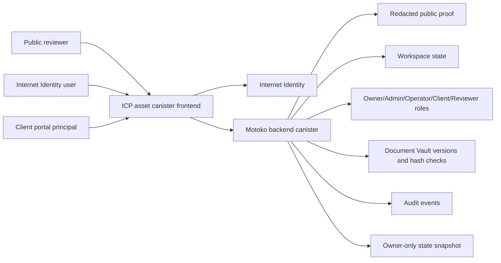

# Architecture

SovereignDesk is an ICP-native client operations workspace. The current mainnet MVP deployment uses two canisters and no external app server. It is a public review deployment, not the final production architecture for confidential client data.

## Mainnet Canisters

- Frontend: `v7inb-hyaaa-aaaal-qw7aq-cai`
- Backend: `vyjlv-kaaaa-aaaal-qw7aa-cai`
- Controller: `7dnyu-motzm-oqehm-762iq-irfd3-taexs-huxbx-z5bdr-4hdjg-j4lih-5ae`

## Current Boundaries

- Public users can read a redacted proof surface.
- Signed users can request access.
- Operators can work inside the workspace.
- Governance can approve access, manage roles, rotate client principals, and export snapshots.
- Client principals see scoped portal data.

## Production Split Target

The current single backend canister is intentionally compact for the MVP. The production target for real client data is:

- Workspace canister: clients, projects, tasks, approvals.
- Vault canister: encrypted document metadata and blob references.
- Audit/proof canister: append-only event proof and certified public state.
- AI canister: operating briefs and human approval records.
- Billing canister: ckBTC/ckUSDC invoices after the portal workflow stabilizes.
